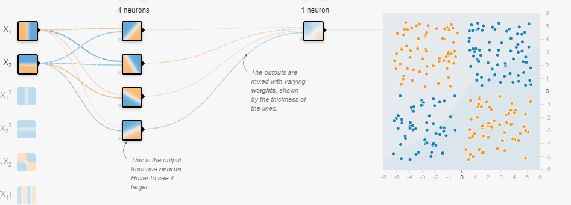

# XOR problem solved in a simple python script

## About this repo

This repository contains the logic and scripts that combine
three packages:
- [Tensorflow](https://www.tensorflow.org/) An end-to-end open source machine learning platform.

## Gallery

This is the actual architecture of the NN:

And this is the reached Acc for this Architecture

Maybe you can reach a loss less than .02 ;-)

### Install

Just download this repo and execute main.py with python interpreter

### Credits

Credits to [The Coding Train](https://thecodingtrain.com/)